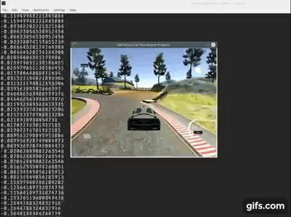

## Behavior Cloning for Self Driving Car
Show your car how to drive in the simulator. It will learn, then drive autonomously.

You can see the demostration video on [YouKu(优酷)](http://t.cn/RxGQ04m) or on [YouTube](https://youtu.be/MV6ncz5suBQ) by click the gif below.

Download Simulator (Provided by [Udacity](https://www.udacity.com/)) here: 
* [Linux](https://d17h27t6h515a5.cloudfront.net/topher/2016/November/5831f0f7_simulator-linux/simulator-linux.zip)
* [macOS](https://d17h27t6h515a5.cloudfront.net/topher/2016/November/5831f290_simulator-macos/simulator-macos.zip)
* [Windows 32-bit](https://d17h27t6h515a5.cloudfront.net/topher/2016/November/5831f4b6_simulator-windows-32/simulator-windows-32.zip)
* [Windows 64-bit](https://d17h27t6h515a5.cloudfront.net/topher/2016/November/5831f3a4_simulator-windows-64/simulator-windows-64.zip)

## Python package dependency
* keras
* tensorflow
* scikit-learn
* numpy
* flask-socketio
* eventlet
* pillow
* h5py

## Training on NVIDIA GPU 
Optional but highly recommended (Accelerate training 5~10x, but a NVIDIA GPU is required):
* CUDA
* cuDNN

## How to run
* Run the simulator from above link. After a new GUI window opens, choose Screen resolution to be 640 X 480 and 
Fastest for the Graphics Quality, click OK. In next window, click on 'AUTONOMOUS MODE'.
* Download the repository.
* Run: *python drive.py model.json*
    * Once the simulator opens, choose autonomous mode for self-driving, or train mode if you want to play around and
     record some training data.  

## Approach and procedures used for getting a useful model

* Collect data. Record data from simulator training mode. (It is a continuous process, e.g. if the vehicle cannot make a 
successful right turn in track 1, then more data about the right turns and its recovery data need to be recorded. ) 
* Pre-process collected data and get it ready for CNN model to learn. Convert raw image data and corresponding angle 
data into a h5 file. (Script used for this step: ./image_angle_to_h5.py)
    * Process the raw image with some computer vision techniques to reduce irrelevant features. (Use CV with cautions
     since it may eliminate necessary information for the model to learn. I only exclude part of the image pixels by 
     image = image[54: ] and resize the remaining part to fit my cnn model. I used canny edge detection, Gaussian smooth
     etc before but it did not work well, since they exclude too much features for the model to learn. ) 
    * Images are flipped horizontally to double the training dataset size and to eliminate left turn tendency (In track 
    1, left turn is much more common than right turn, therefore there are more left turns in training dataset. It 
    introduces bias during training since the model sees much more left turn data.)
    * Images are shuffled and split into training and validation dataset before saving into h5 file. 
    * Save preprocessed images and their angle data into h5 file. If dataset does not exist, create a dataset in the 
    h5 file and save the processed data to the dataset. Append new processed data to specific dataset if it already 
    exists. (In my case, I used )
    * The training and validation datasets are then ready to be fed into model in model.py. (Not really, repeat above
     steps if training data is not sufficient, therefore, it cannot make some left/right turns. Data is as crucial as
      model to pass the simulator test)
* Train CNN model and export the trained model. 
    * Write a batch generator to generator batch data from the h5 file. (Use python generator therefore we do not need 
    to feed all training data into memory)
    * Define a regression CNN model with normalization layers, cnn layers, fully connected layers, regularization layers 
    (dropout) activation layers etc.
        * Build a base CNN model. 
        * Add dropout layer to the base model to prevent over-fitting. 
        * Revised the base model to 3 different models used to train and test. The 3 models are listed in 
        convnet_pipeline_gym.ipynb
        * Used mean squared error (MSE) as loss function (I used MSE in this project and it worked after lots of 
        experiments. But MSE may not be an opt optimizer for this project, since lower validation loss does not necessarily 
        mean better autonomous driving in simulator although they are clearly correlated. Part of reason can be large 
        portion of angles are just 0.)
        
        * The architecture of model used to get final model and weights are shown above. It mainly contains a normalization 
        layer, 5 convolution layers for feature extraction, 4 fully connected layers for regression and 2 regularization 
        layers for preventing over-fitting.  
    * Training the CNN models defined by Keras fit_generator() function 
    * Export trained model and weights for simulator testing.
* Get feedback from simulator autonomous testing. Then fine tune the model or adding more training data depends on the
 different feedback from simulation driving.

## Creation of the training dataset and training process of this model
* Training dataset is as crucial as CNN model used. I used 29100 images and their angles for training and 5820 for 
validation in this project. Meanwhile, I flipped horizontally each training image as described above, therefore I have 
58200 for training and 11640 for validation in total. 
* I used a joystick for training data collection, for it gives much smoother angles.
* I recorded several laps of normal driving and several laps for driving recovery. After preprocessed them by 
./image_angle_to_h5.py, I used my model in model.py to train then test on simulator. After it made the first turn and 
nearly made the sandy left turn (First cross which has a normal lane and a sandy lane to choose), I thought my base 
model 
can work by adding more training data. Then I created 3 similar models from the base model (Only neurons of fully 
connected layers are different) for generating models and their weights (The 3 models are all listed 
in convnet_pipeline_gym.ipynb). 
* Then I recorded another set of training data (around 1500 - 2000 records) just in the left sandy turn to make it 
work. I recorded several (2 or 3 in total) set of similar data and it succeed passed the first sandy left turn. 
* I used similar process to make the vehicle pass all hard turns. But adding another training dataset in next turn 
sometimes make the vehicle stuck at a previously can be passed turn. Finally, I found less epochs(3~5) make 
better driving in the simulator even though its validation loss on validation set is higher comparing to more 
epoch numbers (I set epoch number to be 10 and EarlyStopping patience to be 3 before). 
* By recording more critical turn recovery training data and lower training epochs, I got the model stored in ./model
.json and 
./model.h5. The model used is in model.py and nb_epoch used is 5(4, 6, 7 as number of epoch worked too).  

## A sample dataset
* First 5000 records from my training dataset and first 1000 records from validation dataset can be downloaded from 
[here](https://pan.baidu.com/s/1ge2fF27) (229.6MB)
* I did not upload my full training and validation dataset, for it is about 5.6GB. If you are interested, you can 
generate your own training set by using training mode in simulator.  

## License
MIT license
